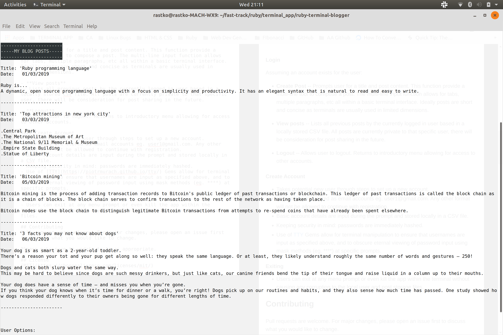

# Ruby Terminal Blogger

A simple, easy to use personal blogging application based in the terminal using Ruby.

Project by [Rastko Beciric](https://github.com/rastko909) and [Jing Li](https://github.com/jliclaire) from [CoderAcademy Melbourne](https://coderacademy.edu.au/).

[ruby-terminal-blogger on GitHub](https://github.com/rastko909/ruby-terminal-blogger)

## Purpose

Ruby Terminal Blogger allows multiple users to create and curate their own *personal* blogs completely in their own terminal. It is fast, light-weight, portable and very easy to use.

## DUMMY ACCOUNTS FOR ANYONE EVALUATING PPLICATION

- **username: rastko909@gmail.com | password: password123**
- **username: jli@gmail.com | password: aaa**

## Functions / Instructions

#### Login 
Assuming an account exists for the user:

- **Create Post**
-- Prompts user for a title and post content. This function provide a multi-line tool to compose a post. The multi-line input function allows for tabs, multiple paragraphs, etc all within a basic terminal interface. Ideally posts are short and concise as terminals are usually used in limited dimensions.

- **View posts**
-- Lists all previous posts by the currently logged in user based in a locally stored CSV file. All posts are currently private to that specific user, there will be consideration for post sharing in the future.

- **Logout**
-- Allows user to logout. Returns to introductory menu allowing for access to other accounts. 

#### Create Account 
- Takes potential new user through steps to set up a new account. 
- Usernames are stored as email accounts eg. user1@gmail.com. Any other format will not be allowed to continue with registration. 
- Basic account details are input during the prompt and stored locally in a CSV file. 
- Keeping security in mind: passwords are immediately hashed. 
- Use of [TTY](https://piotrmurach.github.io/tty/) Gems allow for terminal manipulation to ensure that usernames are input as specified above, and to obscure eternal viewing of password input using mask methods (eg. ****) at specific prompts.

#### Exiting
- Users can exit at any menu prompt or even kill the app within the terminal without causing any corruption to the local user and post storage files. 

## RTB in action

If link does not work: app-in-action.png in ./docs

## Brainstorming / Ideas / Learning Outcomes

- Images of our creative process (Trello, terminal images, sketches, slack, etc) are available in our /docs/ folders.
- We had 2 days to complete this application. 
- Biggest take away from this experience would be considering a proper database for any further expansion of this application eg. using a native ruby gem such as "sqlite". 
- Editing CSV files with the basic Ruby methods was not ideal in this situation. 
- In spite of that, working within the limitations of something as basic as using Ruby and the CSV file format forced some creative/abstract thinking and reinforced some basic coding fundamentals.

## Contributing
Pull requests are welcome. For major changes, please open an issue first to discuss what you would like to change.

Please make sure to update tests as appropriate.

## License
[MIT](https://choosealicense.com/licenses/mit/)
